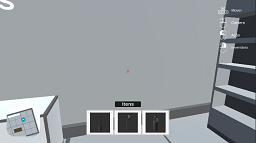

# Avaliação Unity Instituro Eldorado
Avaliação Unity Instituro Eldorado

- Criar um ambiente indoor simples na Unity 3D, com no mínimo 4 salas, 3 corredores e 8 
obstáculos. A navegação deve ser feita utilizando mouse e teclado e a visualização deve 
utilizar uma câmera em primeira pessoa, como em um jogo First-Person Shooter (FPS).

- Em uma das salas, colocar 3 objetos distintos que podem ser coletados pelo jogador. Ao 
apontar a câmera para um dos objetos, ele deve ser identificado com algum efeito visual 
(highlighted/outlined). Ao apertar um botão do mouse, o objeto deve ser coletado, 
sumindo da sala.
- Implementar um menu de inventário, que deve exibir ícones que identifiquem os itens 
coletados.
- Permitir ao usuário soltar um item que está em seu inventário, devolvendo-o para o 
mundo.
- Implementar um minimapa que deve ser exibido no canto inferior da tela.

## Controles

- Movimentação WASD
- Mouse movimenta a câmera
- Botão esquerdo mouse realiza ações ( coletar itens )
- Botão direito mouse abre/fecha inventário
- Pressione "Esc" para sair

## Como jogar

- Extrair arquivos zipados [Build.rar](Build.rar) e executar o arquivo .exe
- Os itens **coletáveis** aparecem no **minimapa**.

